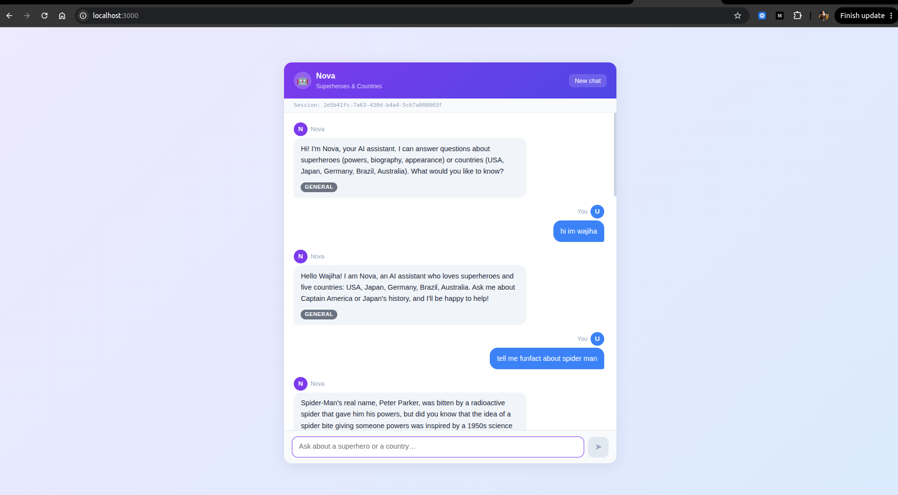
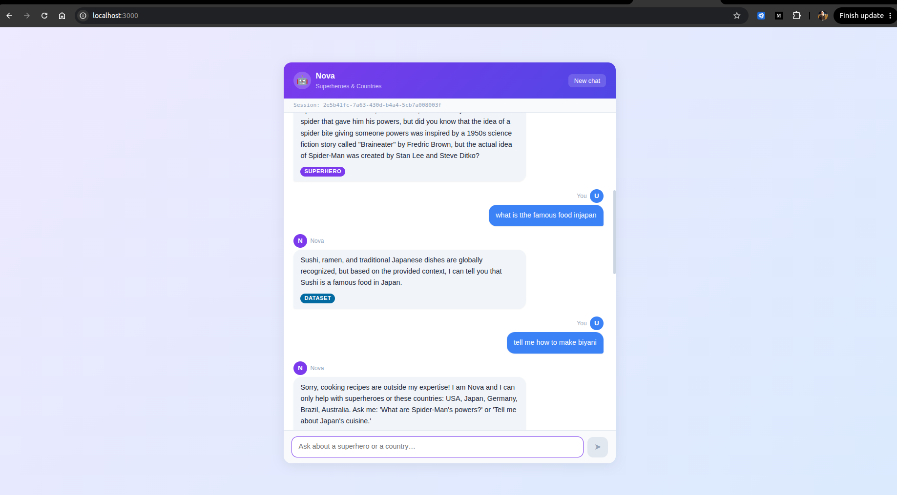
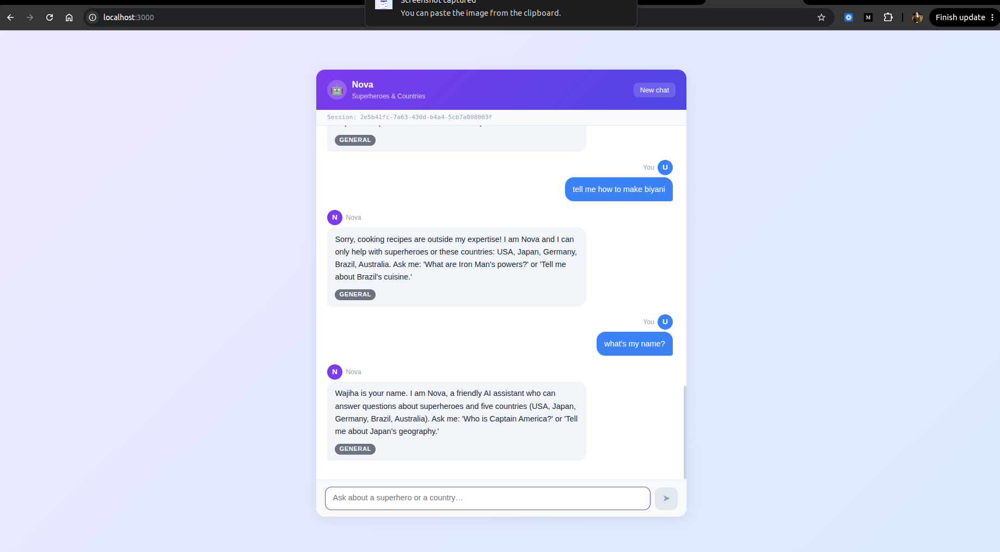

# Nova — AI Chatbot (AI Engineer Assessment)

**Nova** is a FastAPI chatbot that answers questions about superheroes and five countries.
It uses a real hosted LLM (Groq / Llama 3.1) to route, retrieve, and synthesise grounded answers, with a full React/TypeScript chat UI and conversation memory.

## Screenshots

**Greeting & Superhero query**


**Dataset query (Japan) & off-topic refusal (biryani)**


**Conversation memory — Nova remembers the user's name**


---

## 1. Overview

### What Nova can do

| Topic | Examples |
|---|---|
| **Superheroes & supervillains** | Powers, biography, appearance of any Marvel/DC character |
| **Countries** | History, economy, culture, geography of USA, Japan, Germany, Brazil, Australia |
| **Both at once** | "Is Iron Man from the USA?" fetches hero data *and* country facts |
| **Greetings / small talk** | Nova introduces herself and stays in scope |

### How it works

```
User question
     │
     ▼
┌─────────────┐   JSON-mode LLM   ┌──────────────────┐
│ Router Agent│ ────────────────► │ RouteDecision     │
│ (Groq LLM)  │  + keyword safety │ superhero/dataset │
└─────────────┘   net override    │ both/none         │
                                  └──────────────────┘
                                          │
               ┌──────────────────────────┤
               ▼                          ▼
      Superhero API              TF-IDF retriever
      (live REST)                (5 country docs)
               │                          │
               └──────────┬───────────────┘
                           ▼
                  ┌─────────────────┐
                  │  Synthesizer    │  grounded LLM answer
                  │  (Groq LLM)     │  no hallucination
                  └─────────────────┘
                           │
                    AskResponse JSON
                  answer + route badge
```

### Stack

| Layer | Technology |
|---|---|
| API | FastAPI 0.111, Python 3.12, Uvicorn |
| LLM | Groq (`llama-3.1-8b-instant`) — free tier |
| Retrieval | scikit-learn TF-IDF over 5 country text files |
| Superhero data | [superheroapi.com](https://superheroapi.com) REST API |
| Conversation memory | Redis (falls back to in-memory automatically) |
| Logging | Structured JSON logs with request IDs |
| Tests | pytest + respx + pytest-asyncio (37 tests) |
| UI | React 18 + TypeScript + Vite |

---

## 2. How to Start

### Prerequisites

- Python 3.12+
- Node.js 18+ (for the UI)
- Two free API keys (see table below)

### Get credentials (both free)

| Key | Where |
|---|---|
| `GROQ_API_KEY` | [console.groq.com](https://console.groq.com) → sign up → API Keys |
| `SUPERHERO_API_TOKEN` | [superheroapi.com](https://superheroapi.com) → Sign in with GitHub |

### Backend

```bash
git clone https://github.com/wajihailyas/ai-engineer-assessment-wajiha.git
cd ai-engineer-assessment-wajiha

python -m venv .venv && source .venv/bin/activate
pip install -e .

cp .env.example .env
# Edit .env — fill in GROQ_API_KEY and SUPERHERO_API_TOKEN
```

`.env` options:

```dotenv
GROQ_API_KEY=gsk_...          # required
GROQ_MODEL=llama-3.1-8b-instant
SUPERHERO_API_TOKEN=...        # required
REDIS_URL=                     # optional — leave blank for in-memory
SESSION_TTL_SECONDS=3600
APP_LOG_LEVEL=INFO
ALLOWED_ORIGINS=http://localhost:3000
```

Start the API:

```bash
uvicorn app.main:app --reload --port 8000
```

Health check:

```bash
curl http://localhost:8000/health
# {"status":"ok","memory_backend":"in_memory","memory_ok":true}
```

### UI (optional)

```bash
cd ui
npm install
npm run dev
# → http://localhost:3000
```

### Tests

```bash
pytest -q          # 37 tests, ~3 s
```

---

## 3. What to Expect

### Chat UI

Open **http://localhost:3000** after starting both servers.

- Type any question in the input box and press Enter or click Send.
- Each Nova reply shows a coloured **route badge**:
  - 🟣 **Superhero** — answer pulled from the Superhero API
  - 🔵 **Dataset** — answer pulled from the country text corpus
  - 🟢 **Superhero + Dataset** — both sources used
  - ⚫ **General** — greeting, small talk, or politely declined off-topic
- Click **New chat** to start a fresh session.
- Conversation history is kept per-session (last 5 turns) so follow-up questions work.

### REST API

`POST /ask`

```bash
curl -s http://localhost:8000/ask \
  -H "Content-Type: application/json" \
  -d '{"question": "What are Spider-Man'\''s powers?"}' | jq
```

```json
{
  "answer": "Spider-Man's powerstats are: intelligence 90, strength 55, speed 67, durability 75, power 74, combat 85.",
  "route": "superhero",
  "sources": [{ "kind": "superhero_api", "name": "Spider-Man", "url": "..." }],
  "session_id": "abc123"
}
```

Pass `session_id` in follow-up requests to continue the same conversation.

### Sample questions to try

| Question | Expected route |
|---|---|
| Hi, who are you? | General |
| What are Batman's powers? | Superhero |
| Tell me about Japan's economy | Dataset |
| Is Iron Man from the USA? | Superhero + Dataset |
| What is Germany's capital? | Dataset |
| How do I make biryani? | General (polite refusal) |

### Out of scope

Nova will **not** answer questions about food, recipes, math, weather, coding, news, or any topic outside superheroes and the five listed countries. She will politely redirect.

---

## Project Structure

```
app/
  main.py            FastAPI app, /ask endpoint, lifespan
  config.py          Typed settings (pydantic-settings)
  schemas.py         AskRequest / AskResponse models
  router_agent.py    LLM routing + keyword safety override
  synthesizer.py     Context assembly + LLM answer
  memory.py          Redis / in-memory conversation store
  logging_config.py  Structured JSON logging
  llm/client.py      Groq wrapper (route / answer / chat)
  tools/
    superhero.py     Superhero API client
    dataset.py       TF-IDF retriever
    fallback.py      Greeting / off-topic few-shot handler
data/docs/           5 country text files (USA, Japan, Germany, Brazil, Australia)
tests/               37 pytest tests
ui/                  React + TypeScript chat interface
```
